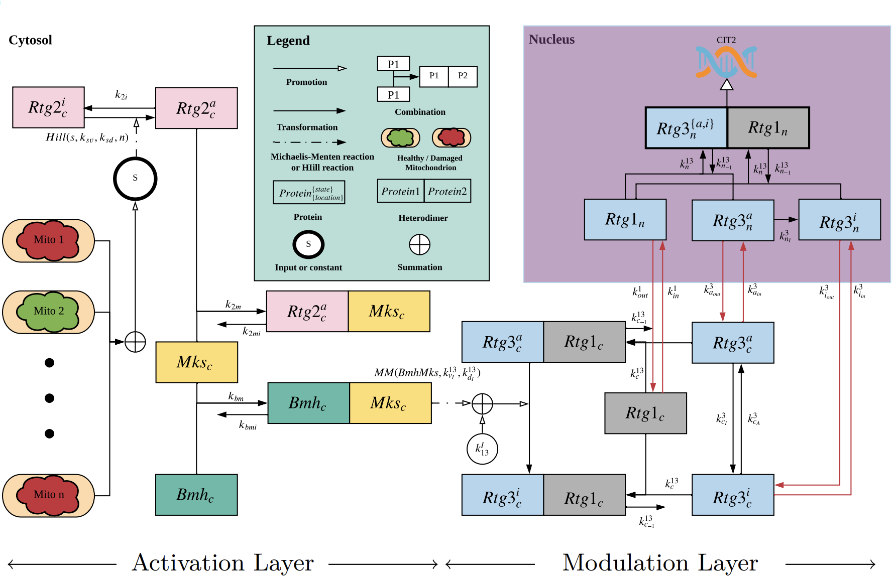

```@meta
CurrentModule = RetroSignalModel
```

# RetroSignalModel

[](https://ntumitolab.github.io/RetroSignalModel.jl/dev)
[](https://github.com/ntumitolab/RetroSignalModel.jl/actions)
[](https://codecov.io/gh/ntumitolab/RetroSignalModel.jl)


Model schematics:




```@index
```

```@autodocs
Modules = [RetroSignalModel]
Order   = [:type, :function, :constant]
```
